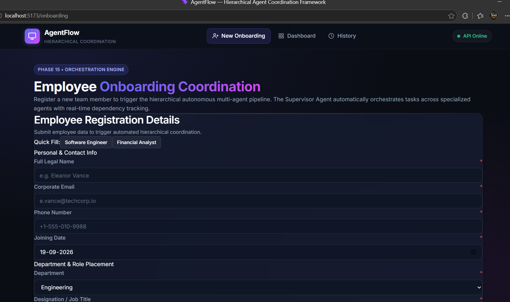

# 📝 Notes, Screenshots & Required Changes

This file is dedicated to logging screenshots, UI mockups, discussion notes, and tracked changes needed for the **Hierarchical Multi-Agent Onboarding System**.

---

## 📸 1. Screenshots & Visual References
> **Tip:** You can paste your image files into the `notes/images/` folder and link them below using:
> ``

### UI Screenshots
<!-- Add your UI screenshots below -->
- *No images added yet. Drop your image into `notes/images/` and reference it here.*
<!-- Example:  -->

### Architecture & Agent Flow Diagrams
<!-- Add any workflow diagrams or architecture drawings here -->
- *Add workflow diagrams or sketches here.*

---

## 🛠️ 2. Changes to be Made

### 🔹 High Priority Changes
- [ ] Need to change UI for form which is very conjusted

- [ ] 

### 🔹 Frontend / UI Enhancements
- [ ] 
- [ ] 

### 🔹 Backend & Agent Coordination Enhancements
- [ ] Need to check is everything is proper, is everything working as expected
- [ ] 

### 🔹 Database & State Tracking
- [ ] 

---

## 💡 3. Discussion & Meeting Notes

### Date: [Date Here]
- **Attendees:**
- **Key Takeaways:**
  - 
  - 
- **Action Items:**
  - 

---

## 📌 4. Additional Reference Links & Resources
- 
